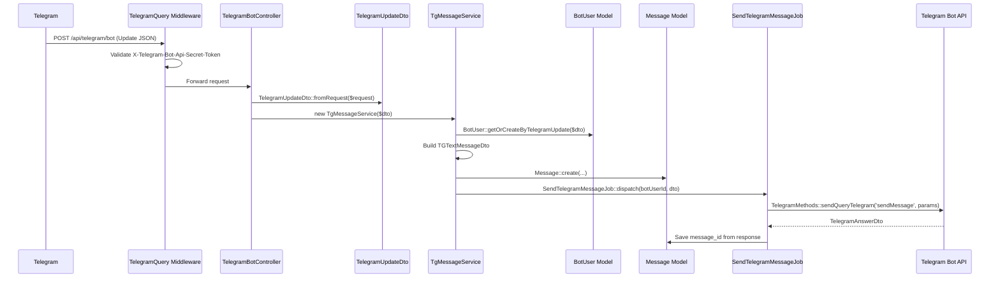
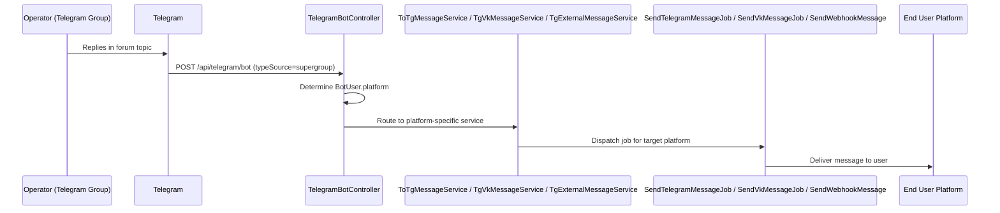
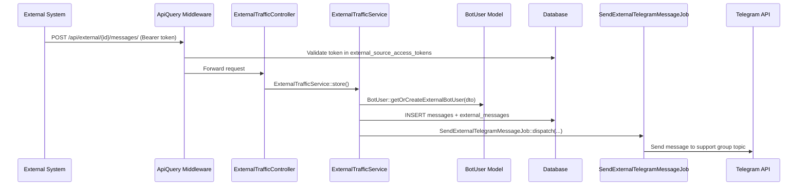
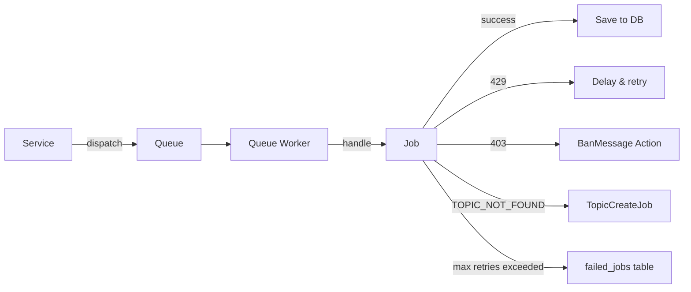
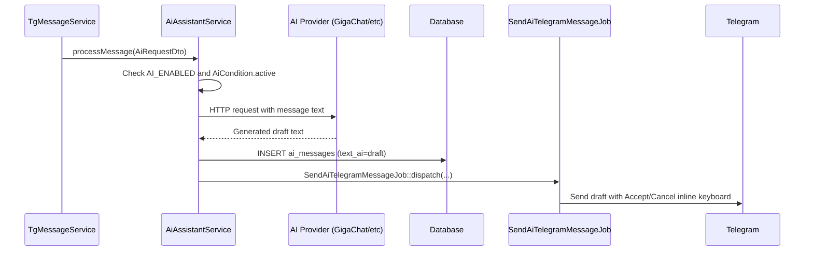
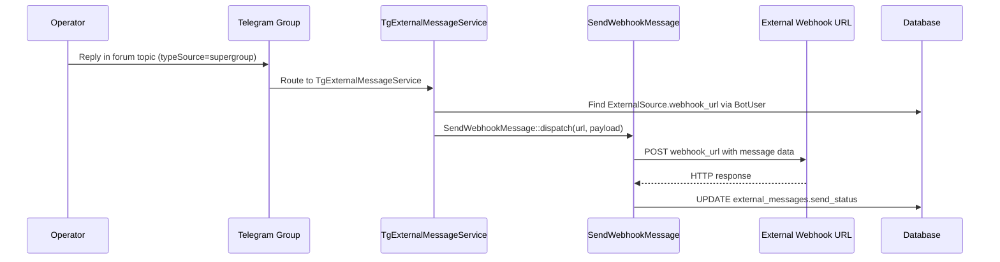

# Data Flow

> **Version:** 1.0.0
> **Context:** Read this file to understand how data moves through the system, from webhook to delivery and back.

---

## 1. Incoming message lifecycle (Telegram → Support Group)

---

## 2. Outgoing message lifecycle (Support Group → End User)

---

## 3. External API message lifecycle

---

## 4. Async flow (Job queue)

All Jobs implement `ShouldQueue` and are processed by the Laravel queue worker.

**Job retry configuration (AbstractSendMessageJob defaults):**
- `$tries = 5` — maximum 5 attempts
- `$timeout = 20` — 20 seconds timeout per attempt
- On 429: delay is set from the `retry_after` value in the Telegram response

---

## 5. Data transformation points

| Point | Input | Transformation | Output |
|---|---|---|---|
| `TelegramUpdateDto::fromRequest()` | `Request` | Parse raw Telegram JSON | Typed `TelegramUpdateDto` |
| `TGTextMessageDto::toArray()` | `TGTextMessageDto` | Filter nulls, prepare for API | Plain array for `sendQueryTelegram()` |
| `TelegramAnswerDto::fromData()` | Raw Telegram response array | Parse response | Typed `TelegramAnswerDto` |
| `ExternalMessageDto::fromRequest()` | `Request` | Parse external API request | Typed `ExternalMessageDto` |
| `VkUpdateDto` | VK webhook JSON | Parse VK payload | Typed `VkUpdateDto` |
| `VkAnswerDto` | VK API response | Parse response | Typed `VkAnswerDto` |

---

## 6. AI assistant data flow

---

## 7. Webhook outbound flow (External Sources)

When an operator replies to an external user's topic:

---

## Checklist

- [ ] All five major flows are documented
- [ ] Job retry/error paths are shown
- [ ] Data transformation points list all DTO factory methods
- [ ] AI flow covers the async job dispatch
