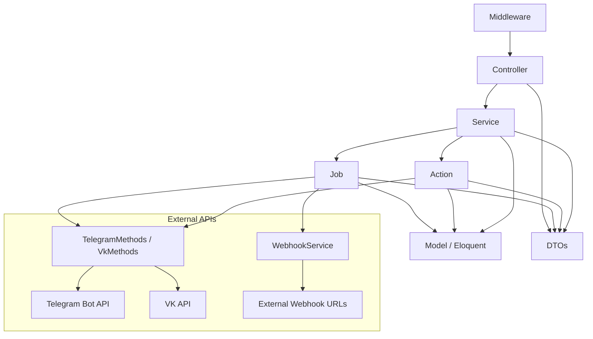

# Architecture Overview

> **Version:** 1.0.0
> **Context:** Read this file before making structural changes, adding new layers, or choosing where to place new code.

---

## 1. Layer diagram



---

## 2. Layer responsibilities

### Middleware (`app/Http/Middleware/`)
- **Allowed:** Validate request authentication, abort on invalid tokens, parse initial request data.
- **Not allowed:** Business logic, database queries beyond token lookup, response formatting.

### Controller (`app/Http/Controllers/`)
- **Allowed:** Receive HTTP request, instantiate the correct DTO from the request, call the appropriate Service, return a response.
- **Not allowed:** Business logic, database queries, external API calls, conditional routing beyond "which service to call".

```php
// ✅ Correct controller
public function store(): void
{
    (new ExternalTrafficService($this->dataHook))->store();
}

// ❌ Incorrect — business logic in controller
public function store(Request $request): void
{
    $user = BotUser::firstOrCreate([...]);
    $msg  = Message::create([...]);
    Http::post($webhookUrl, $msg->toArray());
}
```

### Service (`app/Services/`)
- **Allowed:** Orchestrate business operations, coordinate Actions and Jobs, read from Models.
- **Not allowed:** Direct external API calls, HTTP responses, raw SQL queries.
- Services are instantiated with a DTO in the constructor and call `handle()` or named methods.

### Action (`app/Actions/`)
- **Allowed:** A single, isolated business operation (e.g. sending a contact message, banning a user). May call `TelegramMethods` or `VkMethods` directly via a Job.
- **Not allowed:** Complex orchestration (that belongs in Services), HTTP responses.
- Actions use `execute()` as the primary public method.

### Job (`app/Jobs/`)
- **Allowed:** Async execution of external API calls, retry logic, saving message records after delivery.
- **Not allowed:** Business logic decisions, direct database reads beyond what is needed for the operation.
- All Jobs extend `AbstractSendMessageJob` or implement `ShouldQueue`.

### Model (`app/Models/`)
- **Allowed:** Eloquent relationships, scopes, casts, simple factory/lookup methods (e.g. `getOrCreateByTelegramUpdate`).
- **Not allowed:** Business logic, HTTP calls, job dispatching.

### DTO (`app/DTOs/`)
- **Allowed:** Typed data containers. Factory methods from `Request` objects. `toArray()` for API payloads.
- **Not allowed:** Business logic, database access.

### TelegramMethods / VkMethods / TelegramBot / VkBot
- **Allowed:** Low-level HTTP calls to platform APIs, response parsing into answer DTOs.
- **Not allowed:** Business logic, model access.

---

## 3. Dependency rules

| Layer | May depend on | Must NOT depend on |
|---|---|---|
| Controller | Service, DTO, Model (for type hints) | Job directly, TelegramMethods |
| Service | Action, Job, Model, DTO, Helper | Controller, Middleware |
| Action | Job, Model, DTO, TelegramMethods, VkMethods | Controller, Service |
| Job | Model, DTO, TelegramMethods, VkMethods, WebhookService | Controller, Service, Action |
| Model | — (only Eloquent internals) | Controller, Service, Job |
| DTO | — (data only) | All application layers |

```php
// ✅ Correct — Service dispatches a Job
class TgMessageService extends TemplateMessageService
{
    public function handle(): void
    {
        SendTelegramMessageJob::dispatch($this->botUser->id, $this->messageParamsDTO);
    }
}

// ❌ Incorrect — Service calls Telegram API directly
class TgMessageService
{
    public function handle(): void
    {
        TelegramMethods::sendQueryTelegram('sendMessage', [...]);
    }
}
```

---

## 4. Key architectural decisions

### ADR-001: All external API calls go through Jobs
**Context:** Telegram and VK APIs can be slow or rate-limited.
**Decision:** No external API call is made synchronously in a Controller or Service. Every call is wrapped in a Job that supports retries.
**Rationale:** Webhook endpoints must respond within seconds. Jobs decouple response time from delivery time and provide automatic retry on failure.

### ADR-002: DTOs use `spatie/laravel-data`
**Context:** PHP arrays are untyped and error-prone.
**Decision:** All data transfer between layers uses DTOs that extend `Spatie\LaravelData\Data`.
**Rationale:** Provides type safety, automatic casting, validation, and `toArray()` serialisation.

### ADR-003: AbstractSendMessageJob handles all error cases
**Context:** Telegram returns different error codes (429, 403, 400 with topic/markdown errors).
**Decision:** A single abstract base job class handles all error scenarios centrally.
**Rationale:** Prevents duplication of retry logic and error handling across all sending jobs.

### ADR-004: No Laravel Events/Listeners
**Context:** The application has minimal need for decoupled event handling.
**Decision:** All side effects (job dispatch, model creation) are triggered directly in Services.
**Rationale:** Simpler debugging, fewer indirections for a focused application.

### ADR-005: Multi-provider AI with interface contract
**Context:** Multiple AI providers are needed with the ability to switch between them.
**Decision:** All providers implement `AiProviderInterface`. The active provider is selected via env.
**Rationale:** Allows swapping providers without changing business logic.

---

## 5. Forbidden cross-layer calls

```php
// ❌ Controller calling TelegramMethods directly
class TelegramBotController {
    public function bot_query(): void {
        TelegramMethods::sendQueryTelegram('sendMessage', [...]);
    }
}

// ❌ Model dispatching a Job
class BotUser extends Model {
    public static function boot(): void {
        static::created(function ($user) {
            TopicCreateJob::dispatch($user); // wrong — logic in model
        });
    }
}

// ❌ Job calling a Service
class SendTelegramMessageJob implements ShouldQueue {
    public function handle(): void {
        (new TgMessageService(...))->handle(); // wrong — service in job
    }
}

// ❌ Action containing complex orchestration logic
class SendContactMessage {
    public function execute(BotUser $botUser): void {
        $messages = Message::where(...)->get();
        foreach ($messages as $msg) {
            $this->anotherService->process($msg); // wrong — use Service for orchestration
        }
    }
}
```

---

## Checklist

- [ ] New classes are placed in the correct layer
- [ ] No controller contains business logic
- [ ] No model contains service-layer logic
- [ ] All external API calls go through Jobs
- [ ] New AI providers implement `AiProviderInterface`
- [ ] Architectural decisions are documented here if made
