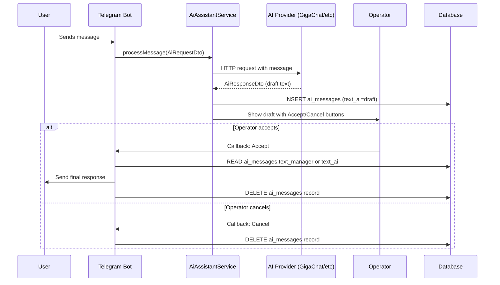

# Domain: AI Assistant

> **Version:** 1.0.0
> **Context:** Read this file before modifying the AI assistant feature, AI providers, or the accept/cancel message flow.

---

## 1. What is this domain?

The AI Assistant domain provides automated draft response generation for support operators. When enabled, incoming messages trigger an AI provider (GigaChat, DeepSeek, or OpenAI) to generate a draft reply. The draft is shown to the operator in the Telegram support group with Accept and Cancel buttons. The operator can approve, edit, or discard the draft.

**Key concepts:**

| Concept | Description |
|---|---|
| `AiCondition` | Per-user flag controlling whether AI is active for that user |
| `AiMessage` | A stored draft: original AI text + operator-edited version |
| `AI_ENABLED` | Global switch — if `false`, AI is completely disabled |
| `AI_AUTO_REPLY` | If `true`, AI replies are sent automatically without operator approval |
| `AI_DEFAULT_PROVIDER` | Which provider to use: `gigachat`, `deepseek`, `openai` |
| `AI_DISABLE_TIMEOUT` | Seconds of inactivity after which AI is disabled for a user |
| `AiProviderInterface` | Contract all AI providers must implement |

---

## 2. Business rules

**BR-301** — AI processing only runs if `AI_ENABLED=true` in the environment configuration.
_Enforced in:_ `app/Services/Ai/AiAssistantService.php`

**BR-302** — AI is per-user. A user has AI active only if their `ai_conditions.active = true`.
_Enforced in:_ `app/Models/AiCondition.php`, `app/Actions/Ai/AiAction.php`

**BR-303** — The AI draft is stored as an `AiMessage` record before being shown to the operator. This allows the operator to edit the text in Telegram and then accept it.
_Enforced in:_ `app/Actions/Ai/AiAcceptMessage.php`, `app/Actions/Ai/EditAiMessage.php`

**BR-304** — When the operator presses "Accept", the `text_manager` field (operator's version) is sent to the user. If `text_manager` is null, `text_ai` (original AI text) is sent.
_Enforced in:_ `app/Actions/Ai/AiAcceptMessage.php`

**BR-305** — When the operator presses "Cancel", the `AiMessage` record is deleted and no message is sent to the user.
_Enforced in:_ `app/Actions/Ai/AiCancelMessage.php`

**BR-306** — All AI callbacks (Accept, Cancel, Edit) arrive on the dedicated AI bot endpoint (`/api/telegram/ai/bot`) processed by `AiTelegramBotController`.
_Enforced in:_ `routes/api.php`, `app/Http/Controllers/AiTelegramBotController.php`

**BR-307** — Each AI provider must implement `AiProviderInterface` with the methods: `processMessage()`, `isAvailable()`, `getProviderName()`, `getModelName()`, `getRateLimitStatus()`.
_Enforced in:_ `app/Contracts/Ai/AiProviderInterface.php`

---

## 3. AI message flow



---

## 4. Provider configuration

| Provider | Env prefix | Config key |
|---|---|---|
| GigaChat | `GIGACHAT_*` | `gigachat` |
| DeepSeek | `DEEPSEEK_*` | `deepseek` |
| OpenAI | `OPENAI_*` | `openai` |

The active provider is selected by `AI_DEFAULT_PROVIDER` in `.env`.

```php
// ✅ Correct — add a new provider by implementing the interface
class MyNewProvider extends BaseAiProvider implements AiProviderInterface
{
    public function processMessage(AiRequestDto $request): ?AiResponseDto { ... }
    public function isAvailable(): bool { ... }
    public function getProviderName(): string { return 'my-provider'; }
    public function getModelName(): string { ... }
    public function getRateLimitStatus(): array { ... }
}

// ❌ Incorrect — adding AI logic directly in a Controller or Service
class TelegramBotController {
    public function bot_query(): void {
        $response = Http::post('https://api.openai.com/...', [...]);
        // This is wrong — AI logic must live in Services/Ai/
    }
}
```

---

## 5. Integration points

- **Messaging domain** — `TgMessageService` triggers AI processing after saving the incoming message.
- **BotUsers domain** — `AiCondition` is linked to `BotUser`.
- **Auth** — AI callbacks use the same `TelegramQuery` middleware as the main bot.

---

## Checklist

- [ ] All business rules reference enforcing files
- [ ] AI message flow diagram covers both accept and cancel paths
- [ ] Provider interface contract is listed
- [ ] Environment variables are documented
