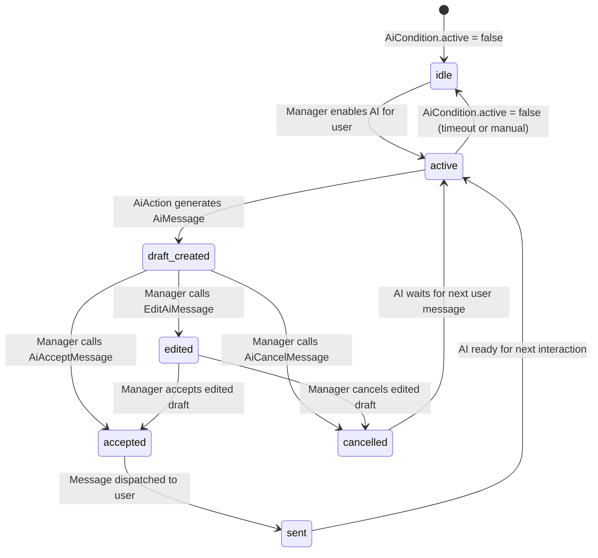

# AI Assistant Domain

> **Purpose:** This file defines business rules, state machines, and invariants for the AI assistant integration domain — draft generation, manager review, acceptance, and cancellation of AI responses.
> **Context:** Read this file before modifying anything related to `AiCondition`, `AiMessage`, AI providers, AI actions, or AI bot controllers.
> **Version:** 1.0

---

## 1. What is this domain?

The AI Assistant domain manages an optional AI layer that can generate draft responses to users. The AI does not send messages directly to users — it produces drafts that must be reviewed and accepted or cancelled by a human manager before sending.

This domain owns: AI condition management, AI message drafts, provider selection, manager review workflow.

This domain does not own: actual message sending (see `domain/messaging.md`), user banning (see `domain/bot-users.md`), external source registration (see `domain/external-sources.md`).

---

## 2. Key Concepts

| Concept | Description |
|---|---|
| AiCondition | Record indicating whether AI is active for a specific `BotUser` |
| AiMessage | A draft response generated by AI, pending manager review |
| Provider | AI service used to generate responses: OpenAI, DeepSeek, or GigaChat |
| Auto-reply | Mode where AI replies are sent automatically without manager review (disabled by default) |
| text_manager | Manager's instruction or context provided to the AI |
| text_ai | AI-generated draft response text |
| Accept | Manager approves and sends the AI draft to the user |
| Cancel | Manager rejects and discards the AI draft |
| Edit | Manager modifies the AI draft before accepting |

---

## 3. Business Rules

**BR-001** — The AI assistant is globally disabled by default (`AI_ENABLED=false`). It must be explicitly enabled via environment configuration.
_Enforced in:_ `config/ai.php @ enabled`

**BR-002** — Auto-reply mode (`AI_AUTO_REPLY=true`) must not be enabled in production unless explicitly approved. In auto-reply mode, AI drafts are sent to users without manager review.
_Enforced in:_ `config/ai.php @ auto_reply`

**BR-003** — An AI draft (`AiMessage`) must be created before any response is sent from the AI path. The draft must include both `text_ai` and optionally `text_manager`.
_Enforced in:_ `app/Actions/Ai/AiAction.php`

**BR-004** — The AI provider used for a request is determined by `AI_DEFAULT_PROVIDER` config. Supported values: `openai`, `deepseek`, `gigachat`.
_Enforced in:_ `config/ai.php @ default_provider`

**BR-005** — An `AiCondition` record must exist and have `active = true` for a given `BotUser` before AI processing starts.
_Enforced in:_ `app/Actions/Ai/AiAction.php`

**BR-006** — A manager must be able to Accept, Cancel, or Edit any AI draft. These are the only three valid actions on a draft.
_Enforced in:_ `app/Actions/Ai/AiAcceptMessage.php`, `app/Actions/Ai/AiCancelMessage.php`, `app/Actions/Ai/EditAiMessage.php`

**BR-007** — The AI session for a user automatically deactivates after `AI_DISABLE_TIMEOUT` seconds (default: 7200s = 2 hours) of inactivity.
_Enforced in:_ `config/ai.php @ disable_timeout` (timeout applied in AiAction flow)

**BR-008** — AI responses must never exceed the token limits defined per provider in config.
_Enforced in:_ `config/ai.php @ providers.*.max_tokens`

**BR-009** — The AI must use a maximum of `max_context_messages` recent messages as conversation context.
_Enforced in:_ `config/ai.php @ max_context_messages` (default: 10)

**BR-010** — If AI confidence is below `confidence_threshold`, the message must be escalated to a human manager.
_Enforced in:_ `config/ai.php @ confidence_threshold` (default: 0.8)

---

## 4. AI Response State Machine



---

## 5. Provider Configuration

| Provider | Env Prefix | Model Config Key | Default Model |
|---|---|---|---|
| OpenAI | `OPENAI_*` | `providers.openai` | `gpt-4.1` |
| DeepSeek | `DEEPSEEK_*` | `providers.deepseek` | `deepseek-chat` |
| GigaChat | `GIGACHAT_*` | `providers.gigachat` | `GigaChat-2-Max` |

```php
// ✅ Correct — read AI provider from config
$provider = config('ai.default_provider');
```

```php
// ❌ Incorrect — hardcoding provider
$provider = 'openai';
```

---

## 6. AI Bot Controller vs Main Bot Controller

| Controller | Path | Purpose |
|---|---|---|
| `TelegramBotController` | `POST /api/telegram/bot` | Handles regular Telegram messages |
| `AiTelegramBotController` | `POST /api/telegram/ai/bot` | Handles AI-specific Telegram callbacks (accept/cancel/edit) |

The AI bot controller receives callback queries from managers when they interact with AI draft messages in Telegram.

---

## 7. Responsible Classes

| Class | Responsibility |
|---|---|
| `app/Actions/Ai/AiAction.php` | Main AI flow — calls provider, creates AiMessage |
| `app/Actions/Ai/AiAcceptMessage.php` | Sends AI draft to user |
| `app/Actions/Ai/AiCancelMessage.php` | Discards AI draft |
| `app/Actions/Ai/EditAiMessage.php` | Allows manager to edit AI draft text |
| `app/Jobs/SendMessage/SendAiTelegramMessageJob.php` | Posts AI draft to Telegram group |
| `app/Jobs/SendMessage/SendAiResponseMessageJob.php` | Sends accepted AI response to user |
| `app/Contracts/AiProviderInterface.php` | Interface all AI providers must implement |
| `app/Helpers/AiHelper.php` | Utility functions for AI response preparation |

---

## 8. Forbidden Behaviors

- ❌ Sending AI-generated text directly to users without manager review (when auto-reply is disabled)
- ❌ Hardcoding AI provider names outside of config
- ❌ Inventing or modifying security/auth mechanisms for AI providers
- ❌ Creating `AiMessage` without corresponding `AiCondition`
- ❌ Enabling `AI_AUTO_REPLY` without explicit configuration
- ❌ Storing API keys for AI providers in code (must use `.env`)
- ❌ Skipping the `confidence_threshold` check

---

## Checklist

- [ ] Overview written
- [ ] Key concepts defined
- [ ] All business rules documented and numbered
- [ ] Enforcement locations listed
- [ ] State machine documented
- [ ] Provider configuration table present
- [ ] Responsible classes listed
- [ ] No forbidden behaviors
