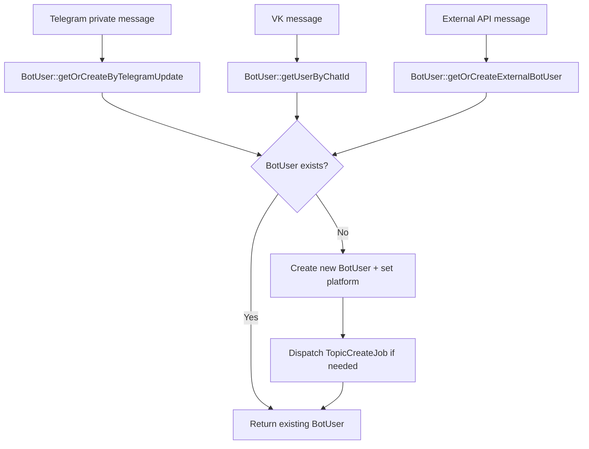
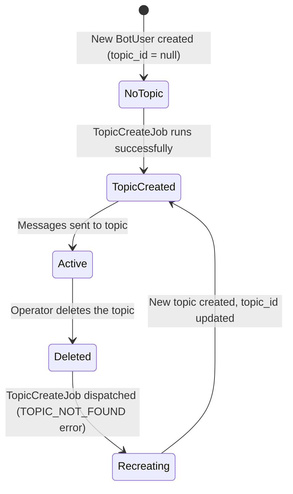
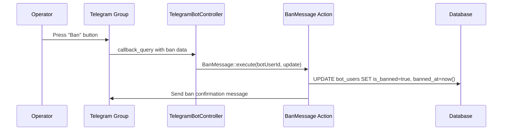

# Domain: BotUsers

> **Version:** 1.0.0
> **Context:** Read this file before modifying BotUser creation, Telegram topic management, or the ban system.

---

## 1. What is this domain?

The BotUsers domain manages the identity and lifecycle of end users. A `BotUser` represents a single user on a single platform. The domain also owns the Telegram forum topic lifecycle (each user gets one topic in the support group) and the ban system.

**Key concepts:**

| Concept | Description |
|---|---|
| `BotUser` | The primary entity; one record per user per platform |
| `chat_id` | The platform-native user ID (Telegram `chat_id` or VK `user_id`) |
| `topic_id` | The Telegram forum topic ID assigned to this user's support thread |
| `platform` | Which channel the user came from: `telegram`, `vk`, `external` |
| `is_banned` | Whether the user is banned from sending messages |
| `ExternalUser` | Extension record mapping an external system's user ID to a BotUser |

---

## 2. Business rules

**BR-101** — A `BotUser` must be created or found before any message is saved or delivered.
_Enforced in:_ `app/Models/BotUser.php @ getOrCreateByTelegramUpdate()`, `getUserByChatId()`, `getOrCreateExternalBotUser()`

**BR-102** — Each `BotUser` has at most one Telegram forum topic (`topic_id`). If the topic is deleted, it must be recreated via `TopicCreateJob`.
_Enforced in:_ `app/Jobs/TopicCreateJob.php`, `app/Jobs/SendMessage/AbstractSendMessageJob.php @ updateTopic()`

**BR-103** — A banned user (`is_banned = true`) must not have their message forwarded to the support group. Instead, the system sends a "banned" notification back to the user.
_Enforced in:_ `app/Models/BotUser.php @ isBanned()`, `app/Actions/Telegram/SendBannedMessage.php`, `app/Actions/Vk/SendBannedMessageVk.php`

**BR-104** — Banning a user is triggered by the operator pressing the "Ban" button in the Telegram support group (callback_query with ban action).
_Enforced in:_ `app/Actions/Telegram/BanMessage.php @ execute()`

**BR-105** — A user is automatically marked as blocked (equivalent to a soft ban from the platform side) when Telegram returns HTTP 403 (bot blocked by user).
_Enforced in:_ `app/Jobs/SendMessage/AbstractSendMessageJob.php @ telegramResponseHandler()`

**BR-106** — The `ExternalUser` record is created on first contact from an external source and links the external user ID to the `BotUser`.
_Enforced in:_ `app/Models/BotUser.php @ getOrCreateExternalBotUser()`

---

## 3. BotUser creation flows

---

## 4. Telegram topic lifecycle

**Rules:**
- `topic_id` is `null` for brand-new users until `TopicCreateJob` runs.
- If `topic_id` is set but the topic is deleted on Telegram, the system detects the `TOPIC_NOT_FOUND` error and dispatches a new `TopicCreateJob`.
- Closing a topic (`CloseTopic` action) sets it to closed status but does NOT delete `topic_id`.
- Deleting a topic (`DeleteForumTopic` action) requires a new `TopicCreateJob` for the next message.

---

## 5. Ban flow

---

## 6. Integration points

- **Messaging domain** — reads `BotUser.platform` and `BotUser.is_banned` before routing messages.
- **AI Assistant domain** — reads `BotUser.id` to find `AiCondition` and `AiMessages`.
- **External Sources domain** — uses `BotUser.external_source_id` to identify the source system.

---

## Checklist

- [ ] All business rules reference enforcing files
- [ ] Topic lifecycle states are correct
- [ ] Ban flow diagram matches current code
- [ ] BotUser creation flows cover all three platforms
