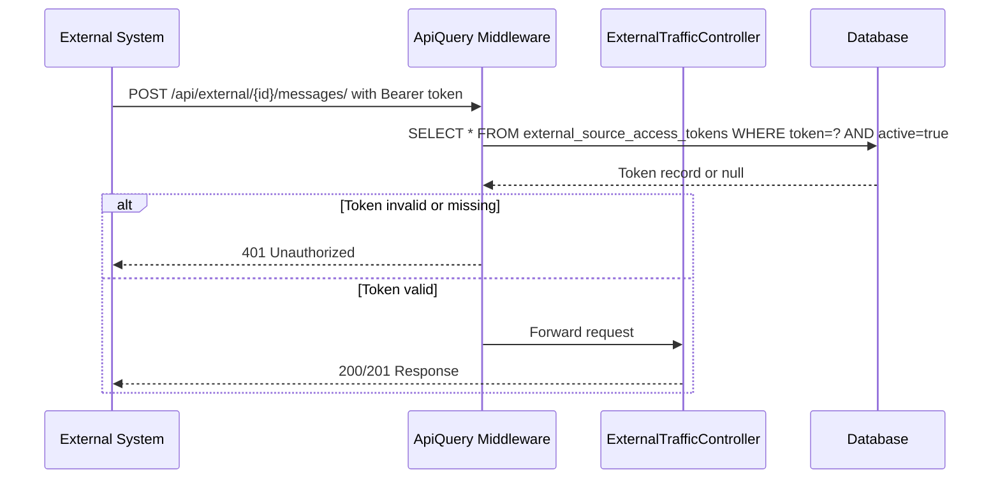
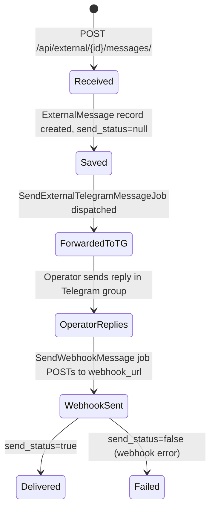

# Domain: External Sources

> **Version:** 1.0.0
> **Context:** Read this file before modifying the External API, external message handling, or token management.

---

## 1. What is this domain?

The External Sources domain allows third-party systems (e.g. a CRM, a custom web chat) to send and receive support messages through this platform. Each external system is registered as an `ExternalSource` and authenticates with a bearer token. Messages from external users appear in the Telegram support group alongside Telegram and VK messages.

**Key concepts:**

| Concept | Description |
|---|---|
| `ExternalSource` | A registered third-party system (e.g. `crm-system`) |
| `ExternalSourceAccessToken` | A bearer token authorising a source to use the API |
| `ExternalUser` | Maps the external system's user ID to an internal `BotUser` |
| `ExternalMessage` | Content details for messages that came via the External API |
| `webhook_url` | URL on the external system where outgoing messages are POSTed |

---

## 2. Business rules

**BR-201** — Every External API request must include a valid bearer token in the `Authorization` header. Requests without a valid token must return HTTP 401.
_Enforced in:_ `app/Http/Middleware/ApiQuery.php`

**BR-202** — A token is valid only if it exists in `external_source_access_tokens` with `active = true`.
_Enforced in:_ `app/Http/Middleware/ApiQuery.php`

**BR-203** — Each external message must reference an `external_id` (the external system's user identifier). The system creates or finds a `BotUser` for that `external_id` + `source` combination.
_Enforced in:_ `app/Models/BotUser.php @ getOrCreateExternalBotUser()`

**BR-204** — When a support operator replies to an external user's topic, the outgoing message must be POSTed to the `ExternalSource.webhook_url` via `SendWebhookMessage` job.
_Enforced in:_ `app/Jobs/SendWebhookMessage.php`, `app/Services/TgExternal/TgExternalMessageService.php`

**BR-205** — The `send_status` column on `external_messages` must be set to `true` after successful delivery to the webhook, and `false` (or `null`) if delivery fails.
_Enforced in:_ `app/Jobs/SendWebhookMessage.php`

**BR-206** — File uploads via the External API must be stored locally and the file ID returned in the response before the message is created.
_Enforced in:_ `app/Services/External/ExternalFileService.php`, `app/Http/Controllers/ExternalTrafficController.php @ sendFile()`

**BR-207** — External messages can be listed, shown, created, updated, and deleted. The update operation only modifies the message text (not the file). The destroy operation removes the `Message` record (and cascades to `ExternalMessage`).
_Enforced in:_ `app/Services/External/ExternalTrafficService.php`

---

## 3. Authentication flow

---

## 4. Message lifecycle (External API)

---

## 5. API endpoint summary

| Method | Path | Purpose |
|---|---|---|
| `GET` | `/api/external/{external_id}/messages/` | List messages for user |
| `GET` | `/api/external/{external_id}/messages/{id}` | Get single message |
| `POST` | `/api/external/{external_id}/messages/` | Create text message |
| `POST` | `/api/external/{external_id}/files/` | Upload file and create message |
| `PUT` | `/api/external/{external_id}/messages/` | Edit message text |
| `DELETE` | `/api/external/{external_id}/messages/` | Delete message |

Full documentation: `rules/api/endpoints.md`

---

## 6. Integration points

- **Messaging domain** — `TgExternalMessageService` and `TgExternalEditService` handle outgoing messages to external sources.
- **BotUsers domain** — External user identity is managed via `BotUser.getOrCreateExternalBotUser()`.
- **Auth** — Token validation is entirely in `ApiQuery` middleware.

---

## Checklist

- [ ] All business rules reference enforcing files
- [ ] Authentication flow diagram is accurate
- [ ] Message lifecycle covers both success and failure paths
- [ ] All 6 API endpoints are listed
