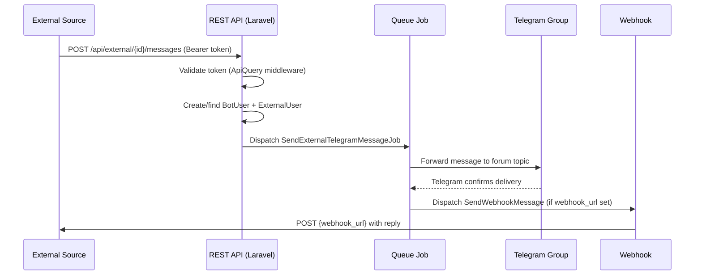

# External Sources Domain

> **Purpose:** This file defines business rules, state machines, and invariants for the External Sources integration domain — registration of external systems, token authentication, REST API message exchange, and webhook delivery.
> **Context:** Read this file before modifying anything related to `ExternalSource`, `ExternalSourceAccessTokens`, `ExternalTrafficController`, `ExternalTrafficService`, or external API routes.
> **Version:** 1.0

---

## 1. What is this domain?

The External Sources domain manages integrations with third-party systems that communicate with the support bot via REST API. External sources send user messages to the bot, and the bot forwards support team replies back via webhooks.

This domain owns: external source registration, token management, incoming message reception, webhook dispatch.

This domain does not own: message routing to Telegram (see `domain/messaging.md`), bot user creation (see `domain/bot-users.md`), AI assistant (see `domain/ai-assistant.md`).

---

## 2. Key Concepts

| Concept | Description |
|---|---|
| External Source | A registered third-party system that integrates with the support bot via REST API |
| Type | `external_sources.type` — `'api'` (default, bearer token + webhook) or `'widget'` (public key only, no token). Drives which admin-panel form/fields apply; does NOT change runtime auth (`ApiQuery`/`WidgetGate` still authenticate by token/public_key regardless of `type`) |
| Access Token | A bearer token (64 chars) that authenticates requests from an External Source |
| Public Key | A low-privilege widget key (`pub_` prefix + 36 random chars) stored in `external_sources.public_key`; identifies the source in browser-embedded widget scripts; NOT a secret |
| external_id | The user's ID within the external system (not the same as Telegram/VK chat_id) |
| source | The name of the External Source (matches `external_sources.name`) |
| webhook_url | URL called when the support team sends a reply to an external user |
| ExternalMessage | Additional message metadata (text, file info, delivery status) stored per message |

---

## 3. Business Rules

**BR-001** — Every request from an External Source must be authenticated with a valid, active bearer token from `external_source_access_tokens`.
_Enforced in:_ `app/Http/Middleware/ApiQuery.php`

**BR-001a** — An External Source may restrict which requests are allowed via `external_sources.allowed_ips` (a JSON array, managed from `/admin/settings/api-webhooks/{source}`). The two consumers check **different subsets** of the same list — domain entries have no effect on the bearer-token API, and are the only thing that matters for the widget gateway:

- **Bearer-token API** (`ApiQuery` → `ExternalSource::isIpAllowed($ip)`): pure IP comparison against `$request->ip()` (exact match). Domain entries in the list are silently ignored — `isIpAllowed()` does NOT delegate to `isRequestAllowed()` despite the similar name. The UI reflects this: the API-type source edit page labels the field "Разрешённые IP-адреса" and its hint mentions only IPs.
- **Widget gateway** (`WidgetGate` → `ExternalSource::isRequestAllowed($request)`): checks both IP entries (against `$request->ip()`) AND domain entries (against the host from the `Origin` header, fallback `Referer`), case-insensitive; `*.example.com` wildcard matches exactly one subdomain level. The UI reflects this: the widget-type source edit page labels the field "Разрешённые домены" and its hint mentions only domains (IP entries still technically work here via `isRequestAllowed()`, but are not the widget's realistic use case since the visitor's browser IP is not the embedding site's IP).
- **OR semantics** — any single matching entry (of the kind the consumer actually checks) allows the request.
- **Empty/NULL list** — no restriction (allow all origins and IPs) for both consumers.

_Enforced in:_ `App\Modules\External\Middleware\ApiQuery`, `App\Modules\External\Middleware\WidgetGate`, `App\Models\ExternalSource` (`isIpAllowed()`, `isRequestAllowed()`)

**BR-002** — An External Source must be registered in `external_sources` before it can send or receive messages.
_Enforced in:_ `app/Models/ExternalSource.php`, `app/Services/External/ExternalTrafficService.php`

**BR-003** — Each External Source may have multiple access tokens, but only `active = true` tokens are valid for authentication.
_Enforced in:_ `app/Models/ExternalSourceAccessTokens.php`

**BR-004** — The `external_id` and `source` combination uniquely identifies a user in an external system. A `BotUser` with `platform = external_source` must have a corresponding `ExternalUser` record.
_Enforced in:_ `app/Models/BotUser.php @ getOrCreateExternalBotUser()`

**BR-005** — When the support team replies to an external user, a webhook notification must be sent to the source's `webhook_url` (if set).
_Enforced in:_ `app/Jobs/SendMessage/SendWebhookMessage.php`, `app/Services/Webhook/WebhookService.php`

**BR-006** — File uploads from External Sources must be accepted via `POST /api/external/{external_id}/files` and stored locally before forwarding to Telegram.
_Enforced in:_ `app/Http/Controllers/ExternalTrafficController.php @ sendFile()`

**BR-007** — Messages from External Sources must be stored in both the `messages` table and the `external_messages` table.
_Enforced in:_ `app/Jobs/SendMessage/AbstractSendMessageJob.php @ saveMessage()`

**BR-008** — The `send_status` field in `external_messages` must be updated after delivery: `true` (delivered), `false` (failed), `NULL` (unknown/pending).
_Enforced in:_ `app/Services/External/ExternalTrafficService.php`

---

## 4. Integration Flow


```mermaid
sequenceDiagram
    participant ES as External Source
    participant API as REST API (Laravel)
    participant Job as Queue Job
    participant TG as Telegram Group
    participant WH as Webhook

    ES->>API: POST /api/external/{id}/messages (Bearer token)
    API->>API: Validate token (ApiQuery middleware)
    API->>API: Create/find BotUser + ExternalUser
    API->>Job: Dispatch SendExternalTelegramMessageJob
    Job->>TG: Forward message to forum topic
    TG-->>Job: Telegram confirms delivery
    Job->>WH: Dispatch SendWebhookMessage (if webhook_url set)
    WH->>ES: POST {webhook_url} with reply
```

---

## 5. REST API Endpoints

| Method | Path | Purpose |
|---|---|---|
| `GET` | `/api/external/{external_id}/messages` | List messages for a user |
| `GET` | `/api/external/{external_id}/messages/{id}` | Get a single message |
| `POST` | `/api/external/{external_id}/messages` | Send a new message from external user |
| `PUT` | `/api/external/{external_id}/messages` | Edit a message |
| `DELETE` | `/api/external/{external_id}/messages` | Delete a message |
| `POST` | `/api/external/{external_id}/files` | Upload a file |

All endpoints require `Authorization: Bearer {token}` header.

---

## 6. Token Rules

```php
// ✅ Correct — token is 64 characters, unique, stored in external_source_access_tokens
$token = Str::random(64);
ExternalSourceAccessTokens::create([
    'external_source_id' => $source->id,
    'token' => $token,
    'active' => true,
]);
```

```php
// ❌ Incorrect — hardcoded token
$token = 'my-secret-token-123';
```

- Tokens must be 64 characters long
- Tokens must be unique (enforced by UNIQUE index)
- Tokens can be deactivated (`active = false`) without deletion
- Never log token values

---

## 7. Webhook Delivery Rules

- Webhook is only dispatched if `external_sources.webhook_url` is not NULL
- Webhook failures must be logged but must not block the Telegram message delivery
- The webhook payload format must match what the External Source expects (documented per integration)

---

## 8. Widget Gateway

The widget gateway is a browser-friendly entry point for external sources that embeds a support chat widget into third-party websites. It is a distinct authentication surface from the bearer-token REST API.

### Source type & admin creation flow

- `external_sources.type` is `'api'` (default) or `'widget'` — see `ExternalSource::TYPE_API` / `TYPE_WIDGET`, `isApi()` / `isWidget()`.
- On `/admin/settings/api-webhooks` (`ApiWebhooksPage`), clicking «Добавить источник» opens a modal to choose the type before creating the source; each choice calls `addSource(string $type = ExternalSource::TYPE_API)`.
- `ExternalSourceService::create()` branches on the created source's type: `api` sources get an auto-issued bearer token (`ExternalSourceTokensService::setAccessToken()`); `widget` sources get an auto-issued public key (`rotatePublicKey()`) instead — no bearer token row is ever created for a widget source.
- The per-source edit page (`ApiWebhookSourcePage` / `admin.settings.api-webhooks.source`) renders conditionally on `$isWidget` (loaded from `$externalSource->isWidget()` in `mount()`): API sources see the webhook URL + bearer token blocks and the REST API/Swagger panel; widget sources see the public key block, a ready-to-paste `<script>` embed snippet (shown once a `public_key` exists), and a live-chat instructions panel instead. The source name field is shared by both types; the `allowed_ips` allowlist field is also shared (same underlying column/textarea) but its **label, hint, and placeholder are type-specific** — "Разрешённые IP-адреса" (API) vs "Разрешённые домены" (widget) — since only IP entries are enforced for API sources and only domain entries are realistic for widget sources (see BR-001a).
- Existing rows created before this column existed default to `type = 'api'` via the migration's DB-level `DEFAULT`, since they were all created through the (then-only) bearer-token flow.
- The list page (`ApiWebhooksPage`) shows a type badge per source card ("API" / "Живой чат") and adapts the webhook/status columns for widget rows (status reflects `public_key` presence, not `accessTokens`).

### Public key

- Each `ExternalSource` has an optional `public_key` column (`varchar`, nullable, unique).
- Generated and rotated from the API Webhooks admin page via `ExternalSourceTokensService::generatePublicKey()` (`pub_` prefix + 36 random chars).
- NULL means no widget key has been assigned yet — the source cannot use the widget gateway until a key is generated.
- The public key is **intentionally not a secret**: it appears in browser-embedded `<script>` tags. It identifies the source but does NOT grant admin or management access.
- Rate limiting and origin/IP checking in `WidgetGate` are the primary abuse-prevention controls.
- Never log the public key (same policy as all tokens).

### WidgetGate middleware (`app/Modules/External/Middleware/WidgetGate.php`)

- Reads `X-Widget-Key` header; looks up the `ExternalSource` by `public_key`; returns 401 if not found.
- Calls `$source->isRequestAllowed($request)`; returns 403 if denied.
- Rate limits: 30/min for POST (send) routes, 120/min for GET (poll) routes, keyed by `{public_key}:{client_ip}`. Returns 429 on limit exceeded.
- Sets CORS headers (`Access-Control-Allow-Origin = request Origin`, methods, headers) on every response.
- Handles OPTIONS preflight — returns 204 with CORS headers, no business logic.
- Attaches the resolved `ExternalSource` to `$request->attributes->get('widget_source')` for downstream use.

### Widget routes

| Method | Path | Description |
|---|---|---|
| `POST` | `/api/widget/{external_id}/messages` | Send a text message from the widget user |
| `POST` | `/api/widget/{external_id}/files` | Send a file (multipart, field: `uploaded_file`, max 20 MB) |
| `GET` | `/api/widget/{external_id}/messages` | Fetch history; `?after={id}` for incremental polling |
| `OPTIONS` | `/api/widget/{external_id}/{any}` | CORS preflight (204) |

Widget routes call `ExternalTrafficService` / `ExternalMessageService` / `ExternalFileService` directly — no internal HTTP loop.

### Widget assets

`public/widget/widget.js`, `public/widget/style.css`, `public/widget/manager.png` are served statically by the web server — no Laravel route is needed.

Embed:
```html
<script src="https://stand/widget/widget.js" data-domain="https://stand" data-key="pub_xxx" defer></script>
```

### externalId security note (v1)

Widget `externalId` is client-generated and stored in `localStorage`. It is not HMAC-signed in v1. A client who knows another client's `externalId` could read their conversation. This is an accepted v1 risk; HMAC-signed sessions are planned for v2.

---

## 9. Forbidden Behaviors

- ❌ Accepting requests without a valid active bearer token (bearer API) or valid public key (widget gateway)
- ❌ Creating `ExternalUser` without corresponding `BotUser`
- ❌ Skipping webhook dispatch when `webhook_url` is set
- ❌ Logging token values or public key values in any log output
- ❌ Using the same token for multiple External Sources
- ❌ Allowing `active = false` tokens to authenticate
- ❌ Treating the public key as a secret (it is intentionally embedded in browser scripts)
- ❌ Skipping origin/IP allowlist check in `WidgetGate`

---

## Checklist

- [ ] Overview written
- [ ] Key concepts defined
- [ ] All business rules documented and numbered
- [ ] Enforcement locations listed
- [ ] Integration flow diagram present
- [ ] REST API endpoint table present
- [ ] Token rules documented
- [ ] Webhook delivery rules documented
- [ ] No forbidden behaviors
