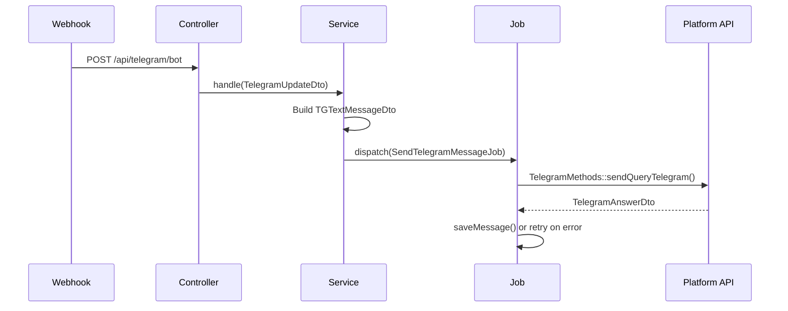

# Domain: Messaging

> **Version:** 1.0.0
> **Context:** Read this file before modifying any message-routing, message-sending, or message-editing logic.

---

## 1. What is this domain?

The Messaging domain is the core of the application. It receives incoming webhook events from Telegram, VK, and the External API, determines which platform and direction the message belongs to, and dispatches the appropriate Job to deliver the message to the target.

**Key concepts:**

| Concept | Description |
|---|---|
| `incoming` message | A message sent by the end user; must be forwarded to the Telegram support group as a new topic reply |
| `outgoing` message | A reply sent by the operator from the Telegram support group; must be forwarded back to the end user |
| `message_type` | Enum `incoming` or `outgoing` stored on every `Message` record |
| `typeSource` | From `TelegramUpdateDto`: `private` = incoming, `supergroup` = outgoing |
| Platform service | A class in `app/Services/` that handles one specific direction and platform combination |

---

## 2. Business rules

**BR-001** — An incoming Telegram message from a private chat must create or find a `BotUser` and dispatch a `SendTelegramMessageJob` to forward it to the support group topic.
_Enforced in:_ `app/Services/Tg/TgMessageService.php`

**BR-002** — An outgoing message from the Telegram support group must be forwarded back to the original platform (Telegram, VK, or External) using the `BotUser.platform` field.
_Enforced in:_ `app/Http/Controllers/TelegramBotController.php @ controllerPlatformTg()`

**BR-003** — A message must never be delivered synchronously via a direct API call in a controller or service. All delivery must go through a Job.
_Enforced in:_ All `*Service.php` files — they dispatch Jobs, never call `TelegramMethods` directly.

**BR-004** — When a Telegram topic is deleted or not found (error `TOPIC_NOT_FOUND`), a `TopicCreateJob` must be dispatched to recreate it.
_Enforced in:_ `app/Jobs/SendMessage/AbstractSendMessageJob.php @ telegramResponseHandler()`

**BR-005** — If a user is banned (`BotUser.is_banned = true`), the system must send a banned message instead of forwarding the user's message.
_Enforced in:_ `app/Actions/Telegram/SendBannedMessage.php`, `app/Actions/Vk/SendBannedMessageVk.php`

**BR-006** — Edited messages from a user must be processed by the Edit service variant (e.g. `TgEditMessageService`), not the Send service.
_Enforced in:_ `app/Http/Controllers/TelegramBotController.php` — routes `edited_message` type to edit service.

**BR-007** — When a Telegram API call returns HTTP 429 (rate limit), the Job must delay itself and retry.
_Enforced in:_ `app/Jobs/SendMessage/AbstractSendMessageJob.php @ telegramResponseHandler()`

**BR-008** — When a Telegram API call returns HTTP 403 (bot blocked), the `BanMessage` action must be called.
_Enforced in:_ `app/Jobs/SendMessage/AbstractSendMessageJob.php @ telegramResponseHandler()`

---

## 3. Platform service matrix

| Direction | Platform | Service class |
|---|---|---|
| Incoming (user → group) | Telegram | `app/Services/Tg/TgMessageService.php` |
| Incoming edited | Telegram | `app/Services/Tg/TgEditMessageService.php` |
| Outgoing (group → user) | Telegram | `app/Services/ActionService/Send/ToTgMessageService.php` |
| Outgoing → VK | VK | `app/Services/TgVk/TgVkMessageService.php` |
| Outgoing → VK edited | VK | `app/Services/TgVk/TgVkEditService.php` |
| Outgoing → External | External | `app/Services/TgExternal/TgExternalMessageService.php` |
| Outgoing → External edited | External | `app/Services/TgExternal/TgExternalEditService.php` |
| Incoming | VK | `app/Services/VK/VkMessageService.php` |
| Incoming | External API | `app/Services/External/ExternalMessageService.php` |

---

## 4. Message type detection (Telegram)

The `TelegramUpdateDto` is parsed from the raw webhook payload. The controller uses these fields to route correctly:

```php
// ✅ Correct routing in TelegramBotController
match ($this->dataHook->typeQuery) {
    'message'         => $this->controllerPlatformTg(),   // new message
    'edited_message'  => $this->controllerPlatformTg(),   // edited message
    'callback_query'  => /* button handler */,
    'chat_member'     => /* ban handler */,
};

// typeSource determines direction:
// 'private'     → incoming from end user
// 'supergroup'  → outgoing from operator
```

---

## 5. Job dispatch chain



---

## 6. Supported message content types (Telegram incoming)

| Type | Detection |
|---|---|
| Text | `$update->text !== null` |
| Photo | `isset($update->rawData['message']['photo'])` |
| Document | `isset($update->rawData['message']['document'])` |
| Voice | `isset($update->rawData['message']['voice'])` |
| Video note | `isset($update->rawData['message']['video_note'])` |
| Sticker | `isset($update->rawData['message']['sticker'])` |
| Location | `isset($update->rawData['message']['location'])` |
| Contact | `isset($update->rawData['message']['contact'])` |

---

## 7. Domain events

_Not applicable — this project does not use Laravel Events. All side effects are handled via direct Job dispatch._

---

## Checklist

- [ ] All business rules reference the file where they are enforced
- [ ] Service matrix covers all platform × direction combinations
- [ ] Job dispatch chain diagram is current
- [ ] Banned user rule (BR-005) is understood before modifying message flow
