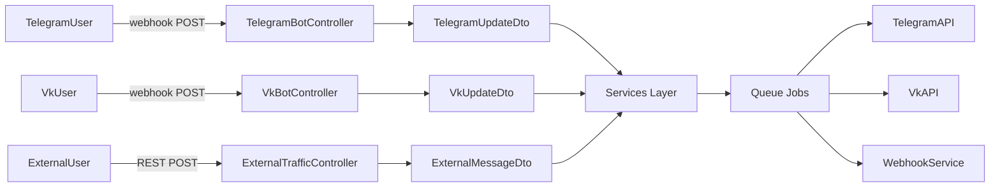
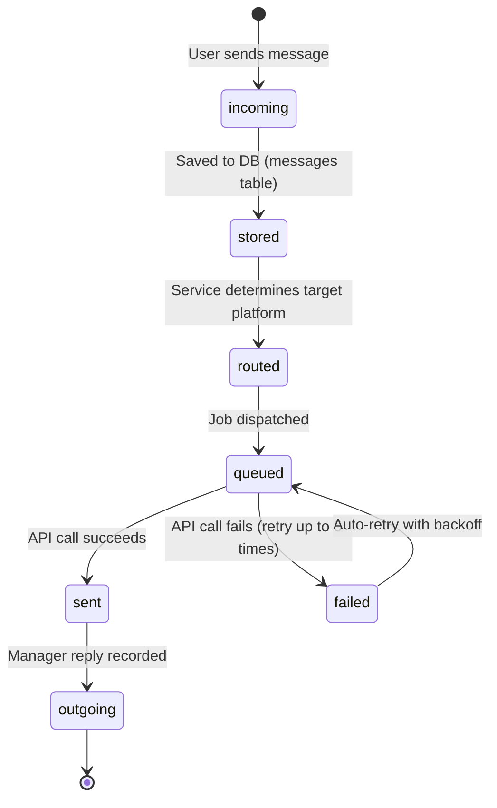

# Messaging Domain

> **Purpose:** This file defines business rules, state machines, and invariants for the core messaging domain — the routing of messages between users (Telegram, VK, External) and the support team.
> **Context:** Read this file before modifying anything related to message sending, editing, routing, or platform integrations.
> **Version:** 1.1

---

## 1. What is this domain?

The Messaging domain is responsible for receiving, routing, storing, and forwarding messages between end users (on Telegram, VK, Max, Avito, Email, or External platforms) and the support team (working in a Telegram supergroup with forum topics and/or the `/admin/chats` workspace).

This domain owns: message creation, message routing, platform-specific sending logic, file handling, keyboard construction.

This domain does not own: user banning (see `domain/bot-users.md`), AI response generation (see `domain/ai-assistant.md`), external source registration (see `domain/external-sources.md`).

---

## 2. Key Concepts

| Concept | Description |
|---|---|
| Forum Topic | A dedicated thread in a Telegram supergroup for each user's conversation |
| Incoming Message | A message sent by the user to the bot |
| Outgoing Message | A message sent by the support team to the user |
| Platform | Source of a message: `telegram`, `vk`, `max`, `avito`, `email`, `external_source` |
| Job | Asynchronous queue task that performs the actual API send |
| Webhook | HTTP callback sent to an External Source when the team replies |
| Button | Interactive element attached to a message (callback, URL, phone, text) |

---

## 3. Architecture Flow


```mermaid
flowchart LR
    TelegramUser -->|webhook POST| TelegramBotController
    VkUser -->|webhook POST| VkBotController
    ExternalUser -->|REST POST| ExternalTrafficController

    TelegramBotController --> DTO[TelegramUpdateDto]
    VkBotController --> DTO2[VkUpdateDto]
    ExternalTrafficController --> DTO3[ExternalMessageDto]

    DTO --> Services[Services Layer]
    DTO2 --> Services
    DTO3 --> Services

    Services --> Jobs[Queue Jobs]
    Jobs --> TelegramAPI
    Jobs --> VkAPI
    Jobs --> WebhookService
```

---

## 4. Business Rules

**BR-001** — A message from a user must always be associated with a `BotUser` record.
_Enforced in:_ `app/Models/BotUser.php @ getOrCreateByTelegramUpdate()`, `getOrCreateExternalBotUser()`

**BR-002** — Every sent message must be recorded in the `messages` table with `bot_user_id`, `platform`, `message_type`, `from_id`, `to_id`.
_Enforced in:_ `app/Jobs/SendMessage/AbstractSendMessageJob.php @ saveMessage()`

**BR-002a** — When persisting a Telegram message, `messages.text` must capture the **caption** for media messages (photo/document), since Telegram puts that text in `caption`, not `text`. `SendTelegramMessageJob::saveMessage()` resolves text as `text ?? caption` for both directions, so a photo-with-caption stores both the caption text and the attachment (otherwise the admin chat workspace would show only the image).
_Enforced in:_ `app/Modules/Telegram/Jobs/SendTelegramMessageJob.php @ saveMessage()`

**BR-003** — A user with `is_banned = true` must not receive replies and must receive a banned notification instead.
_Enforced in:_ `app/Actions/Telegram/SendBannedMessage.php`, `app/Actions/Vk/SendBannedMessageVk.php`

**BR-004** — All message sending to external APIs must go through queue Jobs, never synchronously from Controllers.
_Enforced in:_ `app/Http/Controllers/TelegramBotController.php`, all controllers dispatch Jobs

**BR-005** — The support team works via two SIMULTANEOUS surfaces: the Telegram supergroup with forum topics (when configured) AND the `/admin/chats` workspace (always available). There is no exclusive mode; both surfaces reflect all messages from the shared `messages` DB table. The supergroup is optional — it is active when `ChannelStatusService::telegram()['connected']` is `true` (i.e. `telegram.token` + `telegram.secret_key` are set in the `settings` DB table). When the supergroup is not configured, the admin workspace is the only management surface.
_Enforced in:_ `app/Modules/Telegram/Controllers/TelegramBotController.php @ notifyIncomingMessage()`, `app/Modules/Admin/Services/ChannelStatusService.php`

**BR-005b** — Incoming user messages MUST always be persisted to the `messages` table regardless of whether the Telegram supergroup is enabled. The `messages` table is the single source of truth for the admin workspace at `/admin/chats`. The supergroup forward is an additional, optional step on top of persistence — not a prerequisite for it.
- **Telegram incoming (group ON):** `notifyIncomingMessage()` → `TgMessageService::handleUpdate()` → `SendTelegramMessageJob` → `saveMessage()` persists the row using the group-send response (`from_id = update->messageId`, `to_id = group message_id`).
- **Telegram incoming (group OFF):** `notifyIncomingMessage()` → `persistIncomingTelegramMessage()` persists the row directly (`from_id = update->messageId`, `to_id = 0`). The same `from_id` semantics are preserved so reply threading works correctly if the group is enabled later.
- **VK incoming (group ON):** `VkMessageService::handleUpdate()` → `SendVkTelegramMessageJob` → `saveMessage()` persists after the group send.
- **VK incoming (group OFF):** `VkMessageService::handleUpdate()` → `persistIncomingVkMessage()` persists directly.
- **Max incoming (group ON):** `MaxMessageService::handleUpdate()` → `SendMaxTelegramMessageJob` → `saveMessage()` persists after the group send.
- **Max incoming (group OFF):** `MaxMessageService::handleUpdate()` → `persistIncomingMaxMessage()` persists directly.
- **Avito incoming (group ON, `telegram.group_id` set):** `AvitoMessageService::handleUpdate()` → `SendAvitoTelegramMessageJob` (in `App\Modules\Telegram\Jobs`) forwards into the supergroup topic → `saveMessage()` persists after the group send.
- **Avito incoming (group OFF):** `AvitoMessageService::handleUpdate()` persists the row directly (no supergroup forward), then may dispatch AI.
- **Email incoming (group ON, `telegram.group_id` set):** `EmailMessageService::handleUpdate()` (dispatched from `email:poll`, not a webhook) → `SendEmailTelegramMessageJob` (in `App\Modules\Telegram\Jobs`) forwards into the supergroup topic → `saveMessage()` persists after the group send.
- **Email incoming (group OFF):** `EmailMessageService::handleUpdate()` persists the row directly (no supergroup forward), then may dispatch AI.
- **External incoming:** `TgExternalMessageService::handleUpdate()` → inline `saveMessage()` — always persists regardless of group state (the group is only used for `editForumTopic` icon update, not for the message row).
_Enforced in:_ `app/Modules/Telegram/Controllers/TelegramBotController.php @ persistIncomingTelegramMessage()`, `app/Modules/Vk/Services/VkMessageService.php @ persistIncomingVkMessage()`, `app/Modules/Max/Services/MaxMessageService.php @ persistIncomingMaxMessage()`, `app/Modules/Avito/Services/AvitoMessageService.php @ handleUpdate()`, `app/Modules/Email/Services/EmailMessageService.php @ handleUpdate()`

**BR-015 (Avito v1 limitations)** — Avito is a built-in text-only channel (`app/Modules/Avito/`), registered directly (not via `PlatformChannelRegistry`) in `SendReplyAction`, `DeliverAiAnswerToUser`, and `SendFeedbackForm` (`case 'avito'` branches). Known v1 limitations, documented honestly rather than glossed over:
- **No attachments.** Incoming attachments are not accepted by `AvitoMessageService`. A file attached to a manager's reply is silently skipped with a warning log (`SendReplyAction::sendAvitoReply()`) instead of being delivered — text still sends.
- **No inline keyboards, so no numeric rating.** Avito Messenger has no button/keyboard mechanism, so `SendFeedbackForm`'s `case 'avito'` doesn't ask for a 1-5 rating at all — it asks for a free-text review instead (deliberate product decision, not a stopgap awaiting a callback mechanism). Either way nothing is captured back onto the `Feedback` row: no callback is ever received, `HandleFeedbackRating` is never invoked for Avito, and the record permanently stays `status='awaiting_rating'`. Any review the user sends is just a normal inbound message in the topic.
_Enforced in:_ `app/Modules/Admin/Actions/SendReplyAction.php @ sendAvitoReply()`, `app/Modules/Feedback/Actions/SendFeedbackForm.php`, `app/Modules/Avito/Controllers/AvitoBotController.php`

**BR-016 (Email channel)** — Email is a built-in channel (`app/Modules/Email/`) with no HTTP webhook: incoming mail arrives via IMAP polling (`php artisan email:poll`, scheduled every minute in `routes/console.php`) instead of a Controller. `PollInboxCommand` plays the webhook-controller role: before resolving/creating a `BotUser`, it checks the sender address against the ignore list (`EmailIgnoreListMatcher`, see BR-017); if not ignored, it resolves/creates the `BotUser` (`platform='email'`, `chat_id`=sender email address), short-circuits banned users, and hands the update to `EmailMessageService`. A message is marked `\Seen` on the mail server ONLY after it was fully processed (`EmailMessageService::handledSuccessfully()`) — a mid-run failure leaves it unseen so the next poll retries it; nothing is ever marked seen speculatively, and nothing is ever double-processed. Outgoing replies go through the single `SendEmailMessageJob` (SMTP, via `EmailMailer`) with `In-Reply-To`/`References`/`Subject: Re: ...` headers resolved from `EmailThreadStore` (a Cache-backed, TTL'd record of the last inbound `Message-ID` + Subject per `BotUser` — there is no `messages.message_id` DB column, so this is a deliberate non-durable middle ground; see the Completion Report on issue #214 for the reasoning). Unlike Avito, Email is NOT text-only in either direction: an incoming email's first attachment (at most one — Telegram sends one photo/document per message) is parsed by `EmailImapClient::extractAttachments()` and forwarded as a Telegram `sendPhoto`/`sendDocument` (routed by `EmailMessageService::sendMessage()` on `EmailUpdateDto::$attachments`); HTML bodies are still stripped to plain text for the manager. Same **no inline keyboards** limitation as Avito (the feedback rating prompt in `SendFeedbackForm`'s `case 'email'` is a one-way plain-text prompt — `HandleFeedbackRating` is never reached for this platform). Neither a Telegram forum topic nor the admin workspace has a dedicated place to show an email's subject line, so `EmailUpdateDto::displayText()` prefixes the body with `Тема: {subject}\n\n` (skipped when the subject is blank) before the text reaches Telegram, the persisted `messages` row, or the AI context — all three read from the same formatted string, so they never disagree about what the email actually said. The text sent to Telegram is additionally HTML-escaped (`<`/`>`/`&`) by `EmailMessageService::escapeForTelegramHtml()` — a mail client's own reply-quote header (e.g. `... <address> wrote:`) otherwise breaks Telegram's `parse_mode=html` parser and the reply is silently dropped; the persisted/AI-facing text stays unescaped. Before dispatching `SendEmailTelegramMessageJob`, `EmailMessageService::sendMessage()` also strips `EmailUpdateDto::$providerRef` via `EmailUpdateDto::withoutProviderRef()` — the raw `providerRef` (the reader's live IMAP message object) is not serialization-safe, and `Illuminate\Queue\SerializesModels` `serialize()`s the whole job for the queue payload even under `QUEUE_CONNECTION=sync`; for an email with an attachment this previously produced invalid UTF-8, `json_encode()` failed, the dispatch threw, and the email was never marked seen — retried forever on every poll. `PollInboxCommand`'s own `markSeen()` call still uses the original, un-stripped DTO.

**Outgoing** manager replies CAN carry a single file attachment too, from either reply surface:
- **Admin panel** (`SendReplyAction::sendEmailReply()`) — copies the `UploadedFile` to a queue-safe path (`copyEmailAttachment()`, mirrors the Telegram document-reply path).
- **Telegram group topic** (`TgEmailMessageService::sendPhoto()`/`sendDocument()`, via `sendFileReply()`) — downloads the manager's Telegram photo/document (`TelegramHelper::getFileTelegramPath()` + an HTTP GET) and forwards those same bytes as the SMTP attachment.

Both paths record a `MessageAttachment` locally (`chat-attachments/` on the `local` disk) so the admin workspace can render/download it — email has no provider-native re-fetchable file id, unlike Telegram's `file_id` — and pass the path/name/MIME through `EmailMessageDto` to `EmailMailer::send()`, which attaches it to the SMTP message via `Message::attach()`. A file-only reply (empty text) still sends on both paths.

The **incoming** direction mirrors this shape: `EmailImapClient::extractAttachments()` writes two on-disk copies of the first attachment — a queue-safe temp path (`EmailUpdateDto::$attachments[0]['path']`, fed to `TGTextMessageDto::$uploaded_file_path` and consumed/deleted by Telegram's own upload) and a permanent `chat-attachments/` copy (`['storedPath']`) recorded as a `MessageAttachment` by whichever branch actually delivers the message — `SendEmailTelegramMessageJob::saveMessage()` (group-ON) or `EmailMessageService::recordIncomingAttachment()` (group-OFF).
_Enforced in:_ `app/Modules/Email/Console/PollInboxCommand.php`, `app/Modules/Email/DTOs/EmailUpdateDto.php @ displayText()`, `@ withoutProviderRef()`, `app/Modules/Email/Api/EmailImapClient.php @ extractAttachments()`, `app/Modules/Email/Services/EmailMessageService.php @ escapeForTelegramHtml()`, `@ recordIncomingAttachment()`, `app/Modules/Email/Services/EmailThreadStore.php`, `app/Modules/Email/DTOs/EmailMessageDto.php`, `app/Modules/Email/Api/EmailMailer.php`, `app/Modules/Email/Jobs/SendEmailMessageJob.php`, `app/Modules/Telegram/Jobs/SendEmailTelegramMessageJob.php @ saveMessage()` (persists `updateDto->displayText()`, NOT the HTML-escaped `queryParams->text`), `app/Modules/Admin/Actions/SendReplyAction.php @ sendEmailReply()`, `@ copyEmailAttachment()`, `app/Modules/Telegram/Services/TgEmail/TgEmailMessageService.php @ sendFileReply()`, `app/Modules/Feedback/Actions/SendFeedbackForm.php @ sendEmail()`

**BR-017 (Email ignore list)** — Admins maintain a sender ignore list on `/admin/settings/email` (`EmailIntegrationPage`, textarea field, one entry per line) so newsletters/no-reply senders never spawn a support topic. Stored as a JSON array under `email.ignored_addresses` (lowercased, deduped, no verification required — persisted alongside the IMAP/SMTP fields on a successful «Сохранить»). Each entry is either a full address (`newsletter@example.com`, exact match) or a `@domain.com` suffix that blocks every sender on that domain. `PollInboxCommand` checks `EmailIgnoreListMatcher::isIgnored($update->chatId)` first thing inside `processUpdate()`, before any `BotUser` is resolved/created — a match returns `true` (mark seen, no processing, no BotUser/topic/message row is ever created for that sender).
_Enforced in:_ `app/Modules/Email/Services/EmailIgnoreListMatcher.php`, `app/Modules/Email/Console/PollInboxCommand.php @ processUpdate()`, `app/Livewire/Settings/EmailIntegrationPage.php`

**BR-005a** — Each user has at most one Telegram forum topic (`BotUser.topic_id`). The topic is created lazily: when the supergroup is configured and a message arrives for a user without a topic, `TopicCreateJob` is dispatched.
_Enforced in:_ `app/Modules/Telegram/Jobs/TopicCreateJob.php`, `app/Models/BotUser.php @ topic_id`

**BR-005b** — The forum-topic name is rendered from the `telegram.template_topic_name` template (params `{first_name} {last_name} {username} {name} {display_name} {id} {platform}`) against the user's identity. The identity is resolved **per platform**, NOT via Telegram `getChat` for everyone: `telegram` is fetched live from `getChat`; every other platform (`vk`, `max`, `avito`, …) is labelled from the stored `BotUser` profile (`display_name` / `username`). MAX captures the name/`username` straight from its webhook (`MaxMessageService::captureProfile()`); VK is enriched on demand via `users.get` inside `TopicCreateJob` when `display_name` is still empty. A template param that has no value collapses to an empty string (a single-name profile against `{first_name} {last_name}` still resolves), and only when NO name and NO username exist does the topic fall back to `#{chat_id} ({platform})`. Before, `getChat` was called for every platform and failed for non-Telegram ids, so VK/MAX topics always fell back to the bare id (issue #205).
_Enforced in:_ `app/Modules/Telegram/Jobs/TopicCreateJob.php @ generateNameTopic/getPartsGenerateName`, `app/Modules/Max/Services/MaxMessageService.php @ captureProfile`, `app/Jobs/EnrichBotUserProfileJob.php`

**BR-006** — If a forum topic does not exist when forwarding a message to the supergroup, `TopicCreateJob` must be dispatched before the message send job to ensure the topic is ready.
_Enforced in:_ `app/Modules/Telegram/Jobs/TopicCreateJob.php`

**BR-007** — File messages must be proxied through the app's own storage. Direct Telegram file URLs must not be sent to external systems.
_Enforced in:_ `app/Services/File/FileService.php`

**BR-008** — Message editing must be routed to the correct platform using the original message's platform field.
_Enforced in:_ Services `TgEditService`, `TgExternalEditService`, `TgVkEditService`, `VkEditService`

**BR-009** — Buttons attached to messages must be parsed from text and constructed into platform-specific keyboard formats.
_Enforced in:_ `app/Services/Button/KeyboardBuilder.php`, `app/Services/Button/ButtonParser.php`

**BR-010** — External source messages delivered via REST API must trigger a webhook notification to the source's `webhook_url` when the team replies.
_Enforced in:_ `app/Jobs/SendMessage/SendWebhookMessage.php`, `app/Services/Webhook/WebhookService.php`

**BR-011** — Outgoing messages sent from the admin-panel chat workspace record the authenticated operator as a name snapshot (`messages.sender_name`) and a FK (`messages.sender_user_id`). If the operator is later deleted, `sender_user_id` is nulled by the DB constraint but `sender_name` is preserved. The chat workspace displays the operator avatar/initials when available; falls back to the generic headset glyph when `sender_name` is null (historical messages, AI auto-replies, telegram-group replies).
_Enforced in:_ `app/Modules/Admin/Actions/SendReplyAction.php @ execute()`, `app/Livewire/Chat/ConversationPage.php @ sendReply()`

**BR-012** — Admin-panel replies are MIRRORED to the Telegram supergroup when the supergroup is configured (`ChannelStatusService::telegram()['connected']`). `SendReplyAction::execute()` calls `maybeMirrorToGroup()` at the end: if connected, dispatches `MirrorAdminReplyToGroupJob` with the prefix «Ответ из админки: ». The mirror job NEVER creates a `messages` row and NEVER re-delivers to the user — it is purely an informational copy for managers in the supergroup. If the user's `topic_id` is not yet available, `TopicCreateJob` is dispatched first and `MirrorAdminReplyToGroupJob` retries until the topic exists (5 tries, backoff [5, 10, 20, 30, 60]s).
_Enforced in:_ `app/Modules/Admin/Actions/SendReplyAction.php @ maybeMirrorToGroup()`, `app/Modules/Admin/Jobs/MirrorAdminReplyToGroupJob.php`

**BR-013** — Group replies (messages sent by managers in the Telegram supergroup topic) are delivered directly to the user via the existing `TgMessageService` path. They are NOT re-posted to the supergroup (they are already there). They are saved to `messages` as `message_type='outgoing'` by the job. This ensures the admin panel sees them via polling. Group replies are never re-mirrored.
_Enforced in:_ `app/Modules/Telegram/Services/Tg/TgMessageService.php`

**BR-014 (DEFERRED, issue #172)** — AI Accept-callback operator attribution (`DeliverAiAnswerToUser`, `TelegramBotController` Accept handler) — AI paths continue to pass `null` as the author until a dedicated task implements it.

---

## 5. Message Type State Machine


```mermaid
stateDiagram-v2
    [*] --> incoming: User sends message
    incoming --> stored: Saved to DB (messages table)
    stored --> routed: Service determines target platform
    routed --> queued: Job dispatched
    queued --> sent: API call succeeds
    queued --> failed: API call fails (retry up to 5 times)
    failed --> queued: Auto-retry with backoff
    sent --> outgoing: Manager reply recorded
    outgoing --> [*]
```

---

## 6. Platform-Specific Routing

| Inbound Platform | Reply Platform | Service | Job |
|---|---|---|---|
| `telegram` | Telegram | `TgMessageService` | `SendTelegramMessageJob` |
| `vk` | VK + Telegram mirror | `TgVkMessageService`, `VkMessageService` | `SendVkMessageJob`, `SendVkTelegramMessageJob` |
| `avito` | Avito + Telegram mirror (when configured) | `AvitoMessageService` | `SendAvitoSimpleMessageJob`, `SendAvitoTelegramMessageJob` |
| `email` | Email (SMTP) + Telegram mirror (when configured) | `EmailMessageService` (polled, not webhook) | `SendEmailMessageJob`, `SendEmailTelegramMessageJob` |
| `external_source` | Telegram + Webhook | `TgExternalMessageService` | `SendExternalTelegramMessageJob`, `SendWebhookMessage` |

---

## 7. Job Retry Rules

| Job | Max Tries | Timeout | Backoff |
|---|---|---|---|
| `SendTelegramMessageJob` | 5 | 20s | — |
| `TopicCreateJob` | 3 | — | [60, 180, 300]s |
| `SendVkMessageJob` | default | — | — |
| `SendWebhookMessage` | default | — | — |

- Jobs must handle `TelegramError::TOO_MANY_REQUESTS` by respecting `retry_after` from the API response.
- Jobs must handle `TelegramError::TOPIC_NOT_FOUND` by recreating the topic.

---

## 8. File Handling Rules

- Files are downloaded from Telegram and stored locally in `storage/app/`
- Files are served via `FilesController` (`GET /api/files/{file_id}`)
- File metadata (file_id, file_type, file_name) is stored in `external_messages` table
- Supported file types: photo, document, audio, video, voice

---

## 9. Button Rules

```php
// ✅ Correct — use ButtonParser to extract buttons from text
$parsed = ButtonParser::parse($text);

// ✅ Correct — use KeyboardBuilder to build platform keyboards
$keyboard = KeyboardBuilder::build($buttons, $platform);
```

```php
// ❌ Incorrect — manually constructing raw keyboard arrays in controller
$keyboard = ['inline_keyboard' => [[['text' => 'Yes', 'callback_data' => 'yes']]]];
```

**ButtonType enum values:**
- `callback` — inline button, triggers callback_query
- `url` — inline button, opens URL
- `phone` — reply keyboard, requests phone number
- `text` — reply keyboard, sends text

---

## 10. Forbidden Behaviors

- ❌ Sending messages synchronously from Controllers
- ❌ Calling Telegram/VK API directly from Controllers or Services (must go via `TelegramMethods` / `VkMethods`)
- ❌ Saving messages without `bot_user_id`
- ❌ Sending messages to banned users without the banned notification flow
- ❌ Creating a new forum topic without checking if one already exists
- ❌ Modifying `messages` table without updating related `external_messages` record

---

## Checklist

- [ ] Overview written
- [ ] Key concepts defined
- [ ] All business rules documented and numbered
- [ ] Enforcement locations listed
- [ ] State machine documented
- [ ] Platform routing table present
- [ ] File handling rules documented
- [ ] Button rules documented
- [ ] No forbidden behaviors
