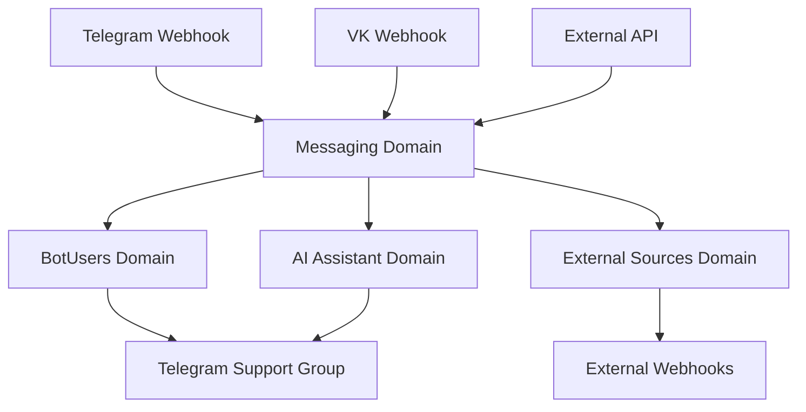

# Domain Overview

> **Version:** 1.0.0
> **Context:** Read this file to understand the high-level business domains before diving into any specific area of the codebase.

---

## 1. What this application does (domain view)

TG Support Bot is a message-routing system that bridges end users (on Telegram, VK, or external systems) with support operators (in a Telegram group). The system has four main business domains:

| Domain | File | Responsibility |
|---|---|---|
| **Messaging** | `domain/messaging.md` | Core message routing and delivery across all platforms |
| **BotUsers** | `domain/bot-users.md` | User identity, lifecycle, Telegram topic management, banning |
| **External Sources** | `domain/external-sources.md` | Third-party REST API integration for custom systems |
| **AI Assistant** | `domain/ai-assistant.md` | AI-powered draft response generation for operators |

---

## 2. Domain interaction map

---

## 3. Key cross-domain concepts

### Platform
A string identifying the communication channel. Possible values: `telegram`, `vk`, `external`.
- Used on `bot_users.platform` and `messages.platform`.
- Determines which Service class handles the message.

### BotUser
The central entity. Every end user on every platform has a `BotUser` record. A `BotUser` links:
- A platform user ID (`chat_id`)
- An optional Telegram forum topic (`topic_id`)
- An optional external source reference

### Message
Every piece of communication is recorded as a `Message` (incoming or outgoing). External messages also have an `ExternalMessage` record with content details.

### Job
All platform API calls (sending messages to Telegram, VK, or external webhooks) are dispatched as Jobs. No synchronous API calls in controllers or services.

---

## 4. Platform routing logic

When a webhook arrives:

1. **Telegram webhook** → `TelegramBotController` → inspects `typeSource`:
   - `private` → message is from a user; route to incoming message service.
   - `supergroup` → message is from an operator; route to outgoing message service.
   - `callback_query` → button action (ban, close topic, AI accept/cancel).

2. **VK webhook** → `VkBotController` → `VkMessageService`.

3. **External API** → `ExternalTrafficController` → `ExternalTrafficService`.

---

## Checklist

- [ ] All four domains are listed
- [ ] Domain interaction diagram is current
- [ ] Platform routing logic is accurate
