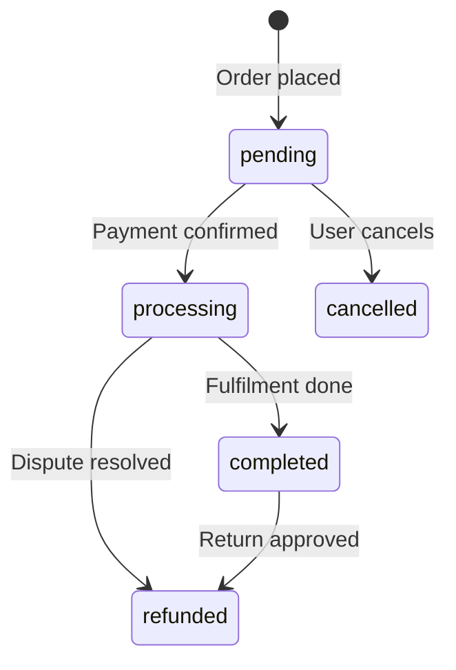

# Application Rules Generation — Master Prompt

> **Version:** 1.0.0  
> **Purpose:** Instruct an AI agent to analyze an existing application and produce a complete, well-structured `rules/` documentation system.  
> **Output:** A set of `.md` files inside a `rules/` directory that serve as a persistent knowledge base for all future AI agents working on this project.

---

## How to use this document

Copy this file into the root of any project and run the following prompt with your AI agent:

```
Read RULES_GENERATION.md in the root of this project and follow every instruction in it precisely.
Analyze the entire codebase before writing a single file.
```

---

## Phase 0 — Analysis (do this before creating any files)

Before writing anything, the agent **must** perform a full codebase analysis:

1. Read and understand the directory structure
2. Identify the framework, language versions, and key dependencies from `composer.json` / `package.json` / `pyproject.toml` (whichever applies)
3. Read all migration files to understand the full database schema
4. Read all model files to understand relationships, scopes, casts, and business rules embedded in models
5. Read all service, action, and use-case classes to extract business logic
6. Read all route files to map the full API / web surface
7. Read all policy and gate definitions to understand authorization rules
8. Read all job, event, listener, and notification classes to map async flows
9. Read existing tests (if any) to understand intended behaviour
10. Read the `.env.example` to understand the configuration surface

**Do not create any files until the full analysis in Phase 0 is complete.**

---

## Phase 1 — Create the `rules/` directory structure

After analysis, create the following directory and file structure exactly:

```
rules/
├── README.md                        ← Master index file (entry point for all AI agents)
├── _meta/
│   └── how-to-write-rules.md        ← Rules for writing rules
├── database/
│   ├── schema.md                    ← ERD and full schema description
│   └── conventions.md               ← DB naming, indexing, migration rules
├── domain/
│   ├── overview.md                  ← High-level domain map
│   └── {domain-name}.md             ← One file per business domain (repeat as needed)
├── api/
│   ├── overview.md                  ← API design principles
│   ├── endpoints.md                 ← Full endpoint catalogue
│   └── responses.md                 ← Response formats, error shapes, pagination
├── auth/
│   └── rules.md                     ← Authentication and authorization rules
├── architecture/
│   ├── overview.md                  ← Layers, patterns, decisions
│   └── data-flow.md                 ← How data moves through the system
├── testing/
│   └── rules.md                     ← Testing rules specific to this application
└── conventions/
    ├── naming.md                    ← Naming conventions for this project
    └── code-style.md                ← Code style rules
```

**Rules for creating the directory structure:**
- Create all directories and files listed above
- If a domain does not exist (e.g. no async jobs), create the file anyway and mark it `_Not applicable — no jobs found in this codebase._`
- Never skip a file — absence of content is documented, not silently omitted
- Add additional domain files under `rules/domain/` for every distinct business domain found

---

## Phase 2 — File specifications

Below are the exact requirements for every file the agent must produce.

---

### `rules/README.md` — Master index (AI entry point)

This is the **first file every AI agent must read** when starting work on this project. It must contain:

**Required sections:**
1. **Project overview** — what the application does in 3–5 sentences
2. **Technology stack** — language version, framework version, key packages
3. **Navigation map** — a table linking to every file in `rules/` with a one-line description
4. **Critical rules** — a short bullet list of the most important non-negotiable rules (max 10)
5. **Onboarding checklist** — a checklist an AI agent must complete before touching any code

**Template:**
```markdown
# {Project Name} — Rules Index

> Read this file first. Always.

## What this application does
{3–5 sentence description}

## Technology stack
| Component       | Technology       | Version |
|---|---|---|
| Language        | {e.g. PHP}       | {x.x}   |
| Framework       | {e.g. Laravel}   | {x.x}   |
| Database        | {e.g. MySQL}     | {x.x}   |
| Cache           | {e.g. Redis}     | {x.x}   |
| Queue           | {e.g. Redis}     | {x.x}   |

## Rules navigation
| File | What it covers |
|---|---|
| `_meta/how-to-write-rules.md`     | How rules files must be written |
| `database/schema.md`              | Full ERD and schema reference |
| `database/conventions.md`         | DB naming, indexing, migration rules |
| `domain/overview.md`              | Business domain map |
| `domain/{name}.md`                | {domain description} |
| `api/overview.md`                 | API design principles |
| `api/endpoints.md`                | Full endpoint catalogue |
| `api/responses.md`                | Response shapes and error formats |
| `auth/rules.md`                   | Auth and authorization rules |
| `architecture/overview.md`        | Layers and architectural decisions |
| `architecture/data-flow.md`       | Data flow diagrams |
| `testing/rules.md`                | Testing rules for this project |
| `conventions/naming.md`           | Naming conventions |
| `conventions/code-style.md`       | Code style rules |

## Critical rules
- {Rule 1}
- {Rule 2}
- ...

## AI agent onboarding checklist
- [ ] Read this file
- [ ] Read `database/schema.md`
- [ ] Read `domain/overview.md`
- [ ] Read `architecture/overview.md`
- [ ] Read the relevant `domain/{name}.md` for the area you are modifying
- [ ] Read `conventions/naming.md`
```

---

### `rules/_meta/how-to-write-rules.md` — Rules for writing rules

This file defines the standard every rules file in this project must meet. It is self-referential — it must itself comply with the rules it defines.

**Required sections:**

#### 1. Purpose of rules files
Explain why this documentation system exists and what problem it solves.

#### 2. Mandatory structure of every rules file
Every `.md` file in `rules/` must contain:
- A `# Title` matching the file's subject
- A `> Context:` blockquote explaining when an AI agent should read this file
- Numbered sections with clear, imperative headings
- At least one `✅ Correct example` and one `❌ Incorrect example` per major rule
- A `## Checklist` section at the end

#### 3. Writing style rules

**Language:**
- Write in short, imperative sentences: "Use X", "Never do Y", "Always Z"
- Avoid vague qualifiers: "try to", "consider", "might want to" — state rules definitively
- Use second person: "the agent must", "you must"

```markdown
✅ Correct:
> Always declare `strict_types=1` at the top of every PHP file.

❌ Incorrect:
> It might be good to consider using strict types when possible.
```

**Examples:**
- Every rule that can be misunderstood must have a code example
- Examples must be syntactically correct and runnable
- Label examples clearly: `✅ Correct` and `❌ Incorrect`
- Never use placeholder code like `// ... do something here` without context

```markdown
✅ Correct example block:
    ```php
    // ✅ Correct
    public function findById(int $id): ?User
    {
        return $this->users->find($id);
    }
    ```
    ```php
    // ❌ Incorrect — missing return type, untyped parameter
    public function findById($id)
    {
        return $this->users->find($id);
    }
    ```

❌ Incorrect example block:
    ```php
    // do the thing correctly
    function example($x) { ... }
    ```
```

**Decomposition rules:**
- One rule per bullet point — never combine two rules in one sentence
- If a section grows beyond 10 bullet points, split it into subsections
- If a topic covers more than 3 distinct concerns, create a separate file

#### 4. Versioning and maintenance
- Every rules file must have a `> Version: x.x` in the header blockquote
- When a rule changes, update the version and add a `## Changelog` section at the bottom
- Never delete a rule — mark it as deprecated with `~~strikethrough~~` and note the replacement

#### 5. Forbidden content in rules files
- ❌ Opinions without justification — every rule must have a reason
- ❌ Duplicate rules that already exist in another file — link instead
- ❌ Broken or hypothetical code examples
- ❌ Vague rules that cannot be verified (e.g. "write clean code")
- ❌ Rules that contradict another file without explicitly noting the override

---

### `rules/database/schema.md` — Database schema

**Required sections:**

#### 1. ERD Overview (Mermaid diagram)
```markdown
## Entity Relationship Diagram

```mermaid
erDiagram
    USERS {
        bigint id PK
        string name
        string email UK
        string password
        enum status
        timestamp email_verified_at
        timestamps
    }
    ORDERS {
        bigint id PK
        bigint user_id FK
        decimal total
        enum status
        timestamps
    }
    USERS ||--o{ ORDERS : "has many"
```
```

#### 2. Table reference
For every table, provide:
- Table name and purpose (one sentence)
- All columns with: name, type, nullable, default, description
- All indexes and their purpose
- All foreign keys

**Template per table:**
```markdown
### `{table_name}`
{One sentence: what this table represents}

| Column | Type | Nullable | Default | Description |
|---|---|---|---|---|
| `id` | `bigint` | No | auto | Primary key |
| `{column}` | `{type}` | {Yes/No} | {value/—} | {description} |

**Indexes:**
- `PRIMARY` on `id`
- `UNIQUE` on `email`
- `INDEX` on `user_id` — used in all user-scoped queries

**Foreign keys:**
- `user_id` → `users.id` — cascade delete
```

#### 3. Relationship map (prose)
Describe every relationship in plain English:
- "A `User` has many `Orders`"
- "An `Order` belongs to one `User` and has many `OrderItems`"
- "A `Product` belongs to many `Orders` through `OrderItems`"

#### 4. Soft deletes inventory
List every table that uses soft deletes and explain why.

#### 5. Enum values inventory
List every enum column with all possible values and their meaning.

---

### `rules/domain/{domain-name}.md` — Business domain rules

Create one file per distinct business domain. Domains are identified from the codebase (e.g. `users.md`, `orders.md`, `payments.md`, `notifications.md`).

**Required sections:**

#### 1. Domain overview
```markdown
> Context: Read this file before modifying anything related to {Domain}.

## What is this domain?
{2–3 sentences describing the domain and its responsibility}

## Key concepts
| Concept | Description |
|---|---|
| {Term} | {Definition as used in this codebase} |
```

#### 2. Business rules
List every business rule found in the codebase for this domain. Each rule must be:
- Numbered
- Written as a declarative statement
- Accompanied by the file where it is enforced

```markdown
## Business rules

**BR-001** — An order can only be cancelled if its status is `pending` or `processing`.  
_Enforced in:_ `app/Services/OrderService.php @ cancelOrder()`

**BR-002** — A user must verify their email before placing an order.  
_Enforced in:_ `app/Http/Middleware/EnsureEmailIsVerified.php`
```

#### 3. State machine (if applicable)
If the domain has a status/state field, document all valid transitions:

```markdown
## Order status transitions



**Rules:**
- Transition from `completed` to `cancelled` is forbidden
- Only admins can trigger `refunded`
```

#### 4. Domain events
List all events dispatched in this domain, when they fire, and what listens to them.

#### 5. Integration points
List every other domain or external service this domain interacts with.

---

### `rules/api/endpoints.md` — Endpoint catalogue

For every route in the application, document:

```markdown
## {HTTP Method} {path}

**Controller:** `{ControllerClass}@{method}`  
**Middleware:** `{list}`  
**Auth required:** Yes / No  
**Role required:** {role or —}

### Request
```json
{
  "field": "type — description"
}
```

### Response `{status code}`
```json
{
  "data": {}
}
```

### Business rules applied
- {BR-001} — {brief reminder}

### Error responses
| Status | Condition |
|---|---|
| `422` | Validation failed |
| `403` | Insufficient permissions |
| `404` | Resource not found |
```

---

### `rules/api/responses.md` — Response format rules

**Required sections:**
1. **Success response envelope** — the standard JSON wrapper for all successful responses
2. **Error response envelope** — the standard shape for all error responses
3. **Validation error format** — the exact shape of 422 responses
4. **Pagination format** — how paginated lists are structured
5. **Rules** — what must never appear in a response (raw stack traces, internal IDs, passwords, etc.)

Include `✅ Correct` and `❌ Incorrect` examples for every format.

---

### `rules/auth/rules.md` — Auth and authorization rules

**Required sections:**
1. **Authentication mechanism** — how users authenticate (Sanctum tokens, session, Passport, etc.)
2. **Token rules** — expiry, refresh, storage requirements
3. **Role and permission inventory** — table of all roles, their permissions, and which routes they can access
4. **Policy inventory** — table of all Policy classes and what they guard
5. **Authorization rules** — explicit rules about who can do what, with examples
6. **Forbidden patterns** — what must never be done (e.g. authorization in models, hardcoded role checks in controllers)

---

### `rules/architecture/overview.md` — Architecture rules

**Required sections:**
1. **Layer diagram** — a Mermaid diagram of the application layers and their dependencies
2. **Layer responsibilities** — what each layer is and is not allowed to do
3. **Dependency rules** — which layer may depend on which (with examples of violations)
4. **Key architectural decisions** — ADR-style decisions with context and rationale
5. **Forbidden cross-layer calls** — explicit `❌` examples of layer violations

---

### `rules/architecture/data-flow.md` — Data flow rules

**Required sections:**
1. **Request lifecycle** — how an HTTP request travels through the application from entry point to response
2. **Async flow** — how jobs, events, and listeners interact
3. **Data transformation points** — where and how data is transformed (DTOs, Resources, etc.)

Use Mermaid `sequenceDiagram` or `flowchart` for visual clarity.

---

### `rules/testing/rules.md` — Project-specific testing rules

This file extends the general testing rules with rules specific to **this application**:

1. **What factories exist** — table of all model factories and their states
2. **Custom test helpers** — list of traits and helpers in `tests/Support/`
3. **Seeding rules** — if seeders exist, when they may be used in tests
4. **Project-specific forbidden patterns** — things that were tried and caused problems in this project

---

### `rules/conventions/naming.md` — Naming conventions

Document every naming convention found or established in the codebase:

1. **Route naming** — pattern used for named routes
2. **Event naming** — past tense events, present tense listeners
3. **Job naming** — gerund form (`ProcessOrder`, `SendInvoice`)
4. **Custom naming deviations** — places where this project intentionally deviates from the framework default, with the reason

---

## Phase 3 — Quality checks before finishing

After creating all files, the agent must verify:

- [ ] `rules/README.md` links to every file in the `rules/` directory
- [ ] Every file has a `> Context:` blockquote explaining when to read it
- [ ] Every file has at least one `✅ Correct` and one `❌ Incorrect` example
- [ ] `database/schema.md` contains a Mermaid ERD and documents every table found in migrations
- [ ] Every business rule in `domain/*.md` references the file where it is enforced
- [ ] All route files have been catalogued in `api/endpoints.md`
- [ ] No file is empty — if content is not applicable, state it explicitly
- [ ] All Mermaid diagrams are syntactically valid

---

## Phase 4 — Maintenance instructions (write into README.md)

The agent must add the following section to `rules/README.md`:

```markdown
## Keeping rules up to date

Rules files are living documents. They must be updated when:

- A new table or column is added → update `database/schema.md`
- A new business rule is implemented → add it to the relevant `domain/*.md`
- A new endpoint is added → add it to `api/endpoints.md`
- A new role or permission is introduced → update `auth/rules.md`
- An architectural decision is made → document it in `architecture/overview.md`

**Rule:** Never merge a PR that introduces a new business rule, endpoint, or schema change
without a corresponding update to the relevant rules file.
```

---

## Checklist for the generating agent

- [ ] Phase 0 complete — full codebase analysis done before any file was created
- [ ] `rules/README.md` created and contains all required sections
- [ ] `rules/_meta/how-to-write-rules.md` created and is self-compliant
- [ ] `rules/database/schema.md` contains a valid Mermaid ERD
- [ ] One `rules/domain/{name}.md` file exists per business domain
- [ ] All business rules are numbered (`BR-001`, `BR-002`, ...) and reference source files
- [ ] All state machines are documented with Mermaid diagrams
- [ ] `rules/api/endpoints.md` documents every route
- [ ] `rules/auth/rules.md` lists all roles, policies, and gates
- [ ] Every file ends with a `## Checklist` section
- [ ] Every major rule has a `✅ Correct` and `❌ Incorrect` example
- [ ] No file is a stub — all content is real, extracted from the actual codebase
